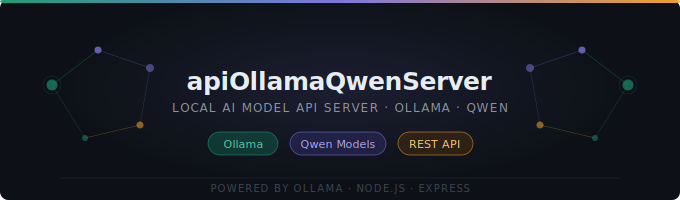

<p align="center">
  
</p>

# AI Backend API

---

## 🇪🇸 Español

Backend desarrollado con Spring Boot 3.5 para gestión de usuarios con autenticación JWT e integración con modelos de IA local via Ollama.

### Requisitos

| Herramienta | Versión mínima | Notas                                          |
| ----------- | -------------- | ---------------------------------------------- |
| Java JDK    | 21             | [Descargar Temurin 21](https://adoptium.net/)  |
| Maven       | 3.9            | O usar el wrapper incluido (`./mvnw`)          |
| Docker      | 24+            | Incluye Docker Compose v2                      |
| Git         | cualquiera     | Para clonar el repositorio                     |

> **IDE recomendado:** [IntelliJ IDEA](https://www.jetbrains.com/idea/) (Community o Ultimate). Tiene soporte nativo para Spring Boot, Maven y variables de entorno, lo que facilita mucho el desarrollo.

### Instalación y ejecución

#### Opción A — Docker Compose (recomendada)

Levanta el backend, PostgreSQL y Ollama con un solo comando. No necesitas instalar nada más allá de Docker.

```bash
# 1. Clonar el repositorio
git clone <url-del-repo>
cd ai-backend

# 2. Crear el archivo de variables de entorno a partir del ejemplo
cp .env.example .env

# 3. Editar .env con tus propios valores
#    (ver sección "Variables de entorno" más abajo)

# 4. Levantar todos los servicios
docker compose up --build

# 5. Descargar el modelo de IA dentro del contenedor de Ollama
docker compose exec ollama ollama pull qwen3:1.7b
```

El backend quedará disponible en `http://localhost:8081`.

#### Opción B — Ejecución local (sin Docker)

Requiere tener PostgreSQL corriendo localmente.

```bash
# 1. Clonar el repositorio
git clone <url-del-repo>
cd ai-backend

# 2. Crear application.properties a partir del ejemplo
cp src/main/resources/application.properties.example \
   src/main/resources/application.properties

# 3. Exportar las variables de entorno en tu terminal
export DB_USERNAME=tu_usuario
export DB_PASSWORD=tu_contraseña
export JWT_SECRET=tu_clave_secreta_de_al_menos_32_caracteres

# En Windows (PowerShell):
# $env:DB_USERNAME="tu_usuario"
# $env:DB_PASSWORD="tu_contraseña"
# $env:JWT_SECRET="tu_clave_secreta_de_al_menos_32_caracteres"

# 4. Compilar y ejecutar
./mvnw spring-boot:run

# En Windows:
# mvnw.cmd spring-boot:run
```

#### Ejecutar con IntelliJ IDEA

1. Abrir la carpeta del proyecto en IntelliJ (`File → Open`).
2. IntelliJ detectará automáticamente el proyecto Maven.
3. Ir a `Run → Edit Configurations → Spring Boot`.
4. En la sección **Environment variables**, añadir:

   ```text
   DB_USERNAME=tu_usuario;DB_PASSWORD=tu_contraseña;JWT_SECRET=tu_clave_secreta
   ```

5. Ejecutar con el botón ▶ o `Shift+F10`.

### Variables de entorno

Copia `.env.example` a `.env` y completa los valores:

| Variable         | Descripción                                      | Ejemplo / Default          |
| ---------------- | ------------------------------------------------ | -------------------------- |
| `POSTGRES_DB`    | Nombre de la base de datos                       | `aidb`                     |
| `DB_USERNAME`    | Usuario de PostgreSQL                            | `tu_usuario`               |
| `DB_PASSWORD`    | Contraseña de PostgreSQL                         | `contraseña_segura`        |
| `JWT_SECRET`     | Clave secreta para firmar tokens JWT (≥ 32 chars)| generada aleatoriamente    |
| `JWT_EXPIRATION` | Expiración del token en milisegundos             | `86400000` (24 h)          |
| `SERVER_PORT`    | Puerto del servidor                              | `8081`                     |
| `OLLAMA_MODEL`   | Modelo de IA a usar                              | `qwen3:1.7b`               |

**Generar un JWT_SECRET seguro:**

```bash
# Linux / Mac
openssl rand -hex 32

# Windows (PowerShell)
[Convert]::ToBase64String((1..32 | ForEach-Object { Get-Random -Maximum 256 }))
```

### Arquitectura

```
src/main/java/com/sebacirk/aibackend/
├── config/
├── controller/
├── dto/
├── entity/
├── repository/
├── security/
└── service/
```

### Paquetes y Clases

#### entity/

- **Role.java** — Define los 3 roles posibles del sistema: `ADMIN`, `USER` y `PREMIUM`.
- **User.java** — Representa la tabla `users` en la base de datos, contiene los campos id, username, email, password y role.

#### repository/

- **UserRepository.java** — Interfaz JPA que permite consultar y guardar usuarios en la base de datos, con métodos para buscar por username o email.

#### dto/

- **LoginRequest.java** — Objeto que recibe las credenciales del usuario (username y password) al hacer login.
- **RegisterRequest.java** — Objeto que recibe los datos del usuario (username, email, password y role) al registrarse.
- **AuthResponse.java** — Objeto que devuelve el token JWT, username y role al cliente tras autenticarse.

#### security/

- **JwtUtil.java** — Genera, valida y extrae información de los tokens JWT usando la clave secreta definida como variable de entorno.
- **JwtFilter.java** — Intercepta cada request HTTP, extrae el token del header `Authorization` y valida si es correcto antes de permitir el acceso.

#### config/

- **SecurityConfig.java** — Define las reglas de seguridad: qué endpoints son públicos, cuáles requieren rol específico y configura la política de sesión stateless.

### Roles y Permisos

| Rol       | Acceso                               |
| --------- | ------------------------------------ |
| `ADMIN`   | Acceso total a todos los endpoints   |
| `PREMIUM` | Acceso a endpoints de IA sin límites |
| `USER`    | Acceso limitado a endpoints de IA    |

### Endpoints

| Método | Endpoint             | Acceso               |
| ------ | -------------------- | -------------------- |
| POST   | `/api/auth/register` | Público              |
| POST   | `/api/auth/login`    | Público              |
| GET    | `/api/ai/**`         | USER, PREMIUM, ADMIN |
| GET    | `/api/ai/premium`    | PREMIUM, ADMIN       |
| GET    | `/api/admin/**`      | ADMIN                |

### Flujo de Autenticación

```
1. Cliente hace POST /api/auth/login con username y password
2. Backend valida credenciales y genera token JWT
3. Cliente incluye token en header: Authorization: Bearer <token>
4. JwtFilter intercepta y valida el token en cada request
5. SecurityConfig verifica si el rol tiene permiso al endpoint
```

### Tecnologías

- Java 21
- Spring Boot 3.5
- Spring Security
- JWT (jjwt 0.12.6)
- Spring Data JPA
- PostgreSQL
- Ollama (Spring AI)
- Docker

---

## 🇬🇧 English

Backend built with Spring Boot 3.5 for user management with JWT authentication and integration with local AI models via Ollama.

### Requirements

| Tool     | Minimum version | Notes                                        |
| -------- | --------------- | -------------------------------------------- |
| Java JDK | 21              | [Download Temurin 21](https://adoptium.net/) |
| Maven    | 3.9             | Or use the included wrapper (`./mvnw`)       |
| Docker   | 24+             | Includes Docker Compose v2                   |
| Git      | any             | To clone the repository                      |

> **Recommended IDE:** [IntelliJ IDEA](https://www.jetbrains.com/idea/) (Community or Ultimate). It has native support for Spring Boot, Maven, and environment variables, which greatly simplifies development.

### Installation and Setup

#### Option A — Docker Compose (recommended)

Starts the backend, PostgreSQL, and Ollama with a single command. No extra installs beyond Docker.

```bash
# 1. Clone the repository
git clone <repo-url>
cd ai-backend

# 2. Create the environment variables file from the example
cp .env.example .env

# 3. Edit .env with your own values
#    (see "Environment variables" section below)

# 4. Start all services
docker compose up --build

# 5. Pull the AI model inside the Ollama container
docker compose exec ollama ollama pull qwen3:1.7b
```

The backend will be available at `http://localhost:8081`.

#### Option B — Local execution (without Docker)

Requires a locally running PostgreSQL instance.

```bash
# 1. Clone the repository
git clone <repo-url>
cd ai-backend

# 2. Create application.properties from the example
cp src/main/resources/application.properties.example \
   src/main/resources/application.properties

# 3. Export environment variables in your terminal
export DB_USERNAME=your_user
export DB_PASSWORD=your_password
export JWT_SECRET=your_secret_key_at_least_32_characters

# On Windows (PowerShell):
# $env:DB_USERNAME="your_user"
# $env:DB_PASSWORD="your_password"
# $env:JWT_SECRET="your_secret_key_at_least_32_characters"

# 4. Build and run
./mvnw spring-boot:run

# On Windows:
# mvnw.cmd spring-boot:run
```

#### Running with IntelliJ IDEA

1. Open the project folder in IntelliJ (`File → Open`).
2. IntelliJ will automatically detect the Maven project.
3. Go to `Run → Edit Configurations → Spring Boot`.
4. In the **Environment variables** section, add:

   ```text
   DB_USERNAME=your_user;DB_PASSWORD=your_password;JWT_SECRET=your_secret_key
   ```

5. Run with the ▶ button or `Shift+F10`.

### Environment Variables

Copy `.env.example` to `.env` and fill in the values:

| Variable         | Description                                       | Example / Default          |
| ---------------- | ------------------------------------------------- | -------------------------- |
| `POSTGRES_DB`    | Database name                                     | `aidb`                     |
| `DB_USERNAME`    | PostgreSQL username                               | `your_user`                |
| `DB_PASSWORD`    | PostgreSQL password                               | `strong_password`          |
| `JWT_SECRET`     | Secret key for signing JWT tokens (≥ 32 chars)    | randomly generated         |
| `JWT_EXPIRATION` | Token expiration in milliseconds                  | `86400000` (24 h)          |
| `SERVER_PORT`    | Server port                                       | `8081`                     |
| `OLLAMA_MODEL`   | AI model to use                                   | `qwen3:1.7b`               |

**Generate a secure JWT_SECRET:**

```bash
# Linux / Mac
openssl rand -hex 32

# Windows (PowerShell)
[Convert]::ToBase64String((1..32 | ForEach-Object { Get-Random -Maximum 256 }))
```

### Architecture

```
src/main/java/com/sebacirk/aibackend/
├── config/
├── controller/
├── dto/
├── entity/
├── repository/
├── security/
└── service/
```

### Packages and Classes

#### entity/ (EN)

- **Role.java** — Defines the 3 possible system roles: `ADMIN`, `USER`, and `PREMIUM`.
- **User.java** — Represents the `users` table in the database, containing the fields id, username, email, password, and role.

#### repository/ (EN)

- **UserRepository.java** — JPA interface for querying and saving users in the database, with methods to search by username or email.

#### dto/ (EN)

- **LoginRequest.java** — Object that receives user credentials (username and password) on login.
- **RegisterRequest.java** — Object that receives user data (username, email, password, and role) on registration.
- **AuthResponse.java** — Object that returns the JWT token, username, and role to the client after authentication.

#### security/ (EN)

- **JwtUtil.java** — Generates, validates, and extracts information from JWT tokens using the secret key loaded from an environment variable.
- **JwtFilter.java** — Intercepts each HTTP request, extracts the token from the `Authorization` header, and validates it before granting access.

#### config/ (EN)

- **SecurityConfig.java** — Defines security rules: which endpoints are public, which require a specific role, and configures the stateless session policy.

### Roles and Permissions (EN)

| Role      | Access                                  |
| --------- | --------------------------------------- |
| `ADMIN`   | Full access to all endpoints            |
| `PREMIUM` | Unlimited access to AI endpoints        |
| `USER`    | Limited access to AI endpoints          |

### Endpoints (EN)

| Method | Endpoint             | Access               |
| ------ | -------------------- | -------------------- |
| POST   | `/api/auth/register` | Public               |
| POST   | `/api/auth/login`    | Public               |
| GET    | `/api/ai/**`         | USER, PREMIUM, ADMIN |
| GET    | `/api/ai/premium`    | PREMIUM, ADMIN       |
| GET    | `/api/admin/**`      | ADMIN                |

### Authentication Flow

```
1. Client sends POST /api/auth/login with username and password
2. Backend validates credentials and generates JWT token
3. Client includes token in header: Authorization: Bearer <token>
4. JwtFilter intercepts and validates the token on each request
5. SecurityConfig checks if the role has permission to access the endpoint
```

### Technologies (EN)

- Java 21
- Spring Boot 3.5
- Spring Security
- JWT (jjwt 0.12.6)
- Spring Data JPA
- PostgreSQL
- Ollama (Spring AI)
- Docker
